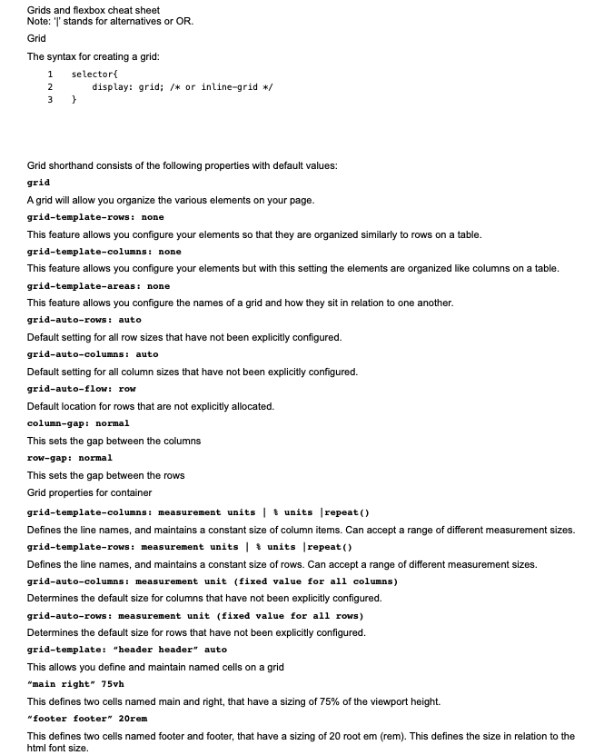
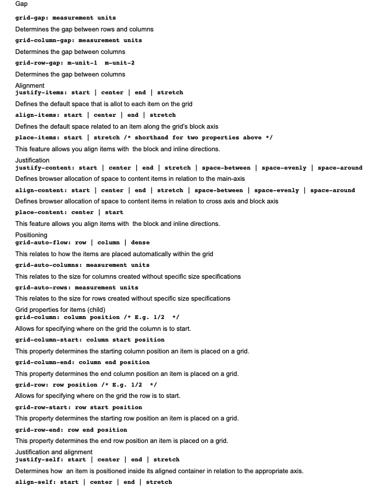
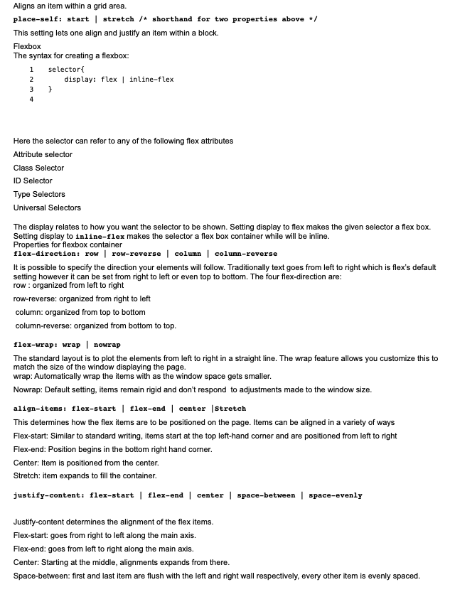
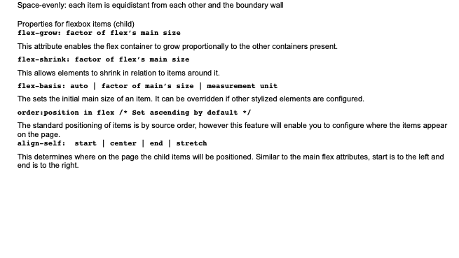

------------------ Semantic HTML cheat sheet -------->

    - here are hundreds of semantic tags available to help describe the meaning of your 
      HTML documents. Below is a cheat sheet with some of the most common ones you’ll use 
      in this course and in your development career.

------------Sectioning tags--------->

    Use the following tags to organize your HTML document into structured sections.

    <header>
    The header of a content section or the web page. The web page header often contains
    the website branding or logo.

    <nav>
    The navigation links of a section or the web page.

    <footer>
    The footer of a content section or the web page. On a web page, it often contains secondary
    links, the copyright notice, privacy policy and cookie policy links.

    <main>
    Specifies the main content of a section or the web page.

    <aside>
    secondary set of content that is not required to understand the main content.

    <article>
    An independent, self-contained block of content such as a blog post or product.

    <section>
    A standalone section of the document that is often used within the body 
    and article elements.

    

    A collapsed section of content that can be expanded if the user wishes to view it.

    

    Specifies the summary or caption of a 
 element.

    <h1><h2><h3><h4><h5><h6>
    Headings on the web page. <h1> indicates the most important heading whereas 
    <h6> indicates the least important.

    Content tags 

    <blockquote>
    Used to describe a quotation.

    <dd>
    Used to define a description for the preceding <dt> element.

    <dl>
    Used to define a description list.

    <dt>
    Used to describe terms inside <dl> elements.

    <figcaption>
    Defines a caption for a photo image.

    <figure>
    Applies markup to a photo image.

    

    Adds a horizontal line to the parent element.

    <li>
    Used to define an item within a list.

    <menu>
    A semantic alternative to <ul> tag.

    <ol>
    Defines an ordered list.

    

    Defines a paragraph.

    <pre>
    Used to represent preformatted text. Typically rendered in the web browser using a monospace font.
    
    <ul>
    Unordered list

    Inline tags
    <a>
    An anchor link to another HTML document.
    
    <abbr>
    Specifies that the containing text is an abbreviation or acronym.

    <b>
    Bolds the containing text. When used to indicate importance use <strong> instead.
    
     
    A line break. Moves the subsequent text to a new line.
    
    <cite>
    Defines the title of creative work (for example a book, poem, song, movie, painting 
    or sculpture). The text in the <cite> element is usually rendered in italics.
    
    <code>
    Indicates that the containing text is a block of computer code.

    <data>
    Indicates machine-readable data.
    
    <em>
    Emphasizes the containing text.
    
    <i>
    The containing text is displayed in italics. Used to indicate idiomatic text or technical terms.
    
    <mark>
    The containing text should be marked or highlighted.
    
    <q>
    The containing text is a short quotation.
    
    <s>
    Displays the containing text with a strikethrough or line through it.
    
    <samp>
    The containing text represents a sample.

    <small>
    Used to represent small text, such as copyright and legal text.
    
    
    A generic element for grouping content for CSS styling.
    
    <strong>
    Displays the containing text in bold. Used to indicate importance.
    
    
    The containing text is subscript text, displayed with a lowered baseline.
    
    
    The containing text is superscript text, displayed with a raised baseline.
    
    <time>
    A semantic tag used to display both dates and times.
    
    <u>
    Displays the containing text with a solid underline.
    
    <var>
    The containing text is a variable in a mathematical expression.
    
    Embedded content and media tags
    <audio>
    Used to embed audio in web pages.
    
    <canvas>
    Used to render 2D and 3D graphics on web pages.
    
    <embed>
    Used as a containing element for external content provided by an external 
    application such as a media player or plug-in application. 
    
    <iframe>
    Used to embed a nested web page. 
    
    
    Embeds an image on a web page.
    
    <object>
    Similar to <embed> but the content is provided by a web browser plug-in.
    
    <picture>
    An element that contains one  element and one or more <source> elements 
    to offer alternative images for different displays/devices.
    
    <video>
    Embeds a video on a web page.
    
    <source>
    Specifies media resources for <picture>, <audio> and<video> elements.
    
    <svg>
    Used to define Scalable Vector Graphics within a web page.
    
    Table tags
    <table>
    Defines a table element to display table data within a web page.
    
    <thead>
    Represents the header content of a table. Typically contains one <tr> element.
    
    <tbody>
    Represents the main content of a table. Contains one or more <tr>elements.
    
    <tfoot>
    Represents the footer content of a table. Typically contains one <tr> element.
    
    <tr>
    Represents a row in a table. Contains one or more <td> elements when used within 
    <tbody> or <tfoot>. When used within <thead>, contains one or more <th> elements.
    
    <td>
    Represents a cell in a table. Contains the text content of the cell.
    
    <th>
    Defines a header cell of a table. Contains the text content of the header.
    
    <caption>
    Defines the caption of a table element.
    
    <colgroup>
    Defines a semantic group of one or more columns in a table for formatting.
    
    <col>
    Defines a semantic column in a table.

----------- Meta Data --------->

    - Authors
    - Description
    - Keywords
    - Robots
    - Viewport
    ----------------------------------------------------------------
    Metadata cheat sheet
    HTML <meta> tags
    Earlier in the course, you learned about meta tags and how you can leverage them to convey information to 
    search engines to better categorize your pages. We recommend that you keep this cheat sheet handy when building 
    your web applications. The structure of a meta tag is as follows.

    Name
    The name of the property can be anything you like, although browsers usually expect a value they understand 
    and can take an action upon. An example would be <meta name="author" content="name"> to state the author of the page.
    
    Content
    The content field specifies the property's value. For example, you can use <meta name="language" 
    content="english">, to specify the language of the webpage to search engines.
    
    Charset
    The charset is a special field that lets you specify the character encoding used for the page so that the browser
    can display it properly. The most frequently used is utf-8, and you would add it to your HTML header as follows:
    <meta charset="UTF-8">
    
    HTTP-equiv
    This field stands for HTTP equivalent, and it’s used to simulate HTTP response headers. This is rare to see, 
    and it’s recommended to use HTTP headers over HTML http-equiv meta tags. For example, the next tag would instruct 
    the browser to refresh the page every 30 minutes: <meta http-equiv="refresh" content="30">

    Basic meta tags (meta tags For SEO)
    <meta name="description"/> provides a brief description of the web page 
    
    <meta name=”title”/> specifies the title of the web page 
    
    <meta name="author" content="name"> specifies the author of the web page  
    
    <meta name="language" content="english"> specifies the language of the web page 

    <meta name="robots" content="index,follow" /> tells search engines how to crawl or index a certain page 
    
    <meta name="google"/> tells Google not to show the sitelinks search box for your page when showing search results 
    
    <meta name="googlebot" content=”notranslate” /> tells Google you don’t want to provide an automatic translation 
     for your page if the user uses a different language  
    
    <meta name="revised" content="Sunday, July 18th, 2010, 5:15 pm" /> specifies the last modified date and time on
     which you have made certain changes 
    
    <meta name="rating" content="safe for kids"> specifies the expected audience for your page 
    
    <meta name="copyright" content="Copyright 2022"> specifies a Copyright 

    <meta http-equiv="..."/> tags
    <meta http-equiv="content-type" content="text/html"> specifies the format of the document returned by the server 
    
    <meta http-equiv="default-style"/>  specifies the format of the styling document 
    
    <meta http-equiv="refresh"/> specifies the duration of the page before it’s considered stale 
    
    <meta http-equiv=”Content-language”/> specifies the language of the page 
    
    <meta http-equiv="Cache-Control" content="no-cache"> instructs the browser how to cache your page 
    
    Responsive design/mobile meta tags
    <meta name="format-detection" content="telephone=yes"/> indicates that telephone numbers should appear as hypertext
    links that can be clicked to make a phone call 
    
    <meta name="HandheldFriendly" content="true"/> specifies that the page can be properly visualized on mobile devices 
    
    <meta name="viewport" content="width=device-width, initial-scale=1.0"/> specifies the area of the window in which 
    web content can be seen

----------- Layout Design --------->
  
     - Navbar layout
     - Carousel layout
     - Blog layout
     - Dashboard layout

----------- Open Graph Protocol --------->

    That's correct, the Open Graph Protocol is a set of metadata rules that allows 
    web pages to describe themselves to social networks. Social media platforms use these 
    meta tags to create a preview of the shared web page. 

----------- CSS layout Flex and Grid --------->

    - display: flex is one dimension
    - display:grid is two dimensional

    Alignment properties
    Let’s examine a few alignment properties inside the flex. There are four main properties used to align a flex 
    container and items present inside it:
    
    justify-content. For item alignment on main axis.
    
    align-items. For item alignment on cross axis.
    
    align-self. For unique flex items on cross axis.
    
    align-content. Used for packing flex lines and control over space.
    
    Of these, justify-content and align-items are frequently used for the respective two axes.
    
    Let’s first examine the use of justify-content which has a value of ‘left’ by default.

    flex-wrap:
    The default for this property is ‘nowrap’ which means the items will span the entire width of the axis. 

    flex-direction: 
    This property is used to set the main axis, which is a ‘row’ by default. It basically means you are changing your 
    ‘main’ axis from horizontal rows to vertical columns.

     align-items:
     The alignment on the cross-axis is done with the help of this property. Let’s change the value for it to ‘flex-end’

     align-self:
     This property can be used on individual items inside the flex.

    gap:
    gap property can be used to create space between the items along the main axis. You can also individually configure the
    gaps in rows and columns using row-gap and column-gap properties.  

------------- Absolute units -------------->

    Absolute units are constant across different devices and have a fixed size. They are useful for activities like 
    printing a page. They are not so suitable when it comes to the wide variety of devices in use today that have 
    different viewport sizes. Because of this, absolute units are used when the size of the web page is known and 
    will remain constant.
    The table for absolute units can be seen below:
    
    Unit             Name                            Comparison

     Q               Quarter-millimeters             1Q = 1/40th of 1cm
     mm              Millimeters                     1mm = 1/10th of 1cm
     cm              Centimeters                     1cm = 37.8px = 25.2/64in
     in              Inches                          1in = 2.54cm = 96px
     pc              Picas                           1pc = 1/6th of 1in
     pt              Points                          1pt = 1/72nd of 1in
     px              Pixels                          1px = 1/96th of 1in
    
    Of these, the pixels and centimeters are most frequently used for defining properties.

---------------- Relative values ------------>

    When you create a web page, you will almost never have only a single element present inside it. Even in 
    case of containers such as flexboxes and grids, there’s usually more than one element present that
    rules are applied to. Relative values are defined ‘in relation’ to the other elements present inside the
    parent element. Additionally, they are defined ‘in relation’ to the viewport or the size of the visible 
    web page. Given the dynamic nature of web pages today and the variable size of devices in use, relative 
    units are the go-to option in many cases. Below is a list of some of the important relative units.
    
    Unit             Description and relativity
    
    em               Font size of the parent where present.
    ex               x-co-ordinate or height of the font element.
    ch               Width of the font character.
    rem              Font size of the root element.
    lh               Value computed for line height of parent element.
    rlh              Value computed for line height of root element which is <html>.
    vw               1% of the viewport width.
    vh               1% of the viewport height.
    vmin             1% of the smaller dimension of viewport.
    vmax             1% of the larger dimension of viewport.
    %                Denotes a percentage value in relation to its parent element.
    
    Many of these units are used in terms of the relative size of fonts. Some units are more suitable depending on 
    the relative context. Like when the dimensions of the viewport are important, it's more appropriate to use vw and 
    vh. In a broader context, the relative units you will see most frequently used are percentage, em, vh, vw and rem.
    
    Much like the absolute and relative units discussed above, certain properties have their own set of acceptable 
    values that need to be taken into account. For example, color-based properties such as backgroundcolor will have 
    values such as hexadecimal, rgb(), rgba(), hsl(), hsla() and so on. Each property should be explored on an 
    individual basis and practicing with the code will help you to decide which of these units of measurement are 
    the most suitable choice. 

---------------- Deep Dive in CSS layout ------------>

    - Flexbox is one dimensional and grid is two dimensional
    - display: flex or display: grid
    - Use Flex for simple layout and grid for complex layout

    - Great content for learning CSS flex
     https://css-tricks.com/snippets/css/a-guide-to-flexbox/#aa-basics-and-terminology

